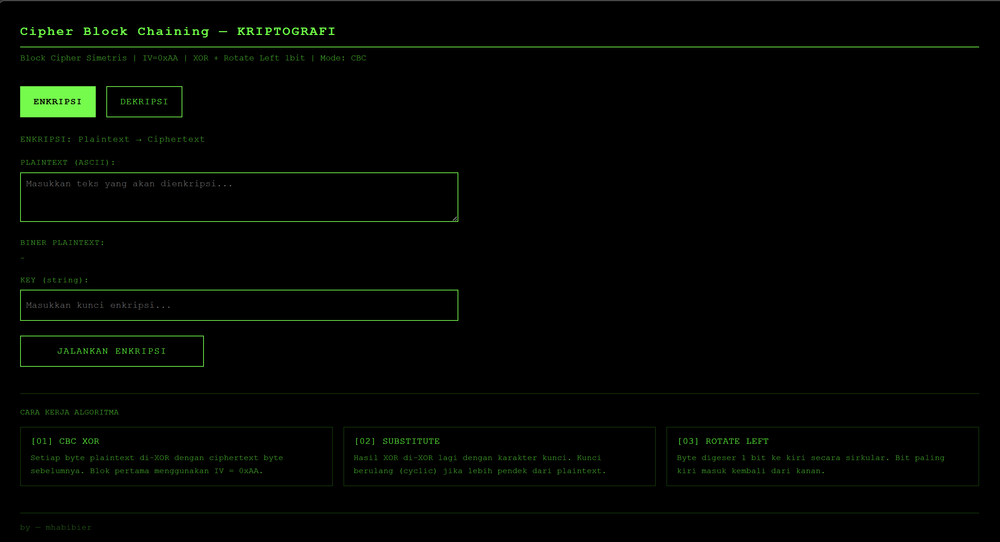
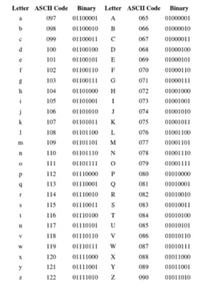

# 🔐 CBC Cryptography Web Simulator

Website ini merupakan simulasi **kriptografi block cipher simetris** menggunakan mode **Cipher Block Chaining (CBC)** dengan kombinasi operasi:

[](.)

- XOR (Exclusive OR)
- Substitute (menggunakan key)
- Rotasi bit (Rotate Left & Rotate Right)

---

## 🔤 Tabel ASCII



ASCII digunakan untuk merepresentasikan karakter menjadi angka (8-bit) sebelum diproses dalam algoritma enkripsi.

---

## 📖 Konsep Dasar

### 🔹 Block Cipher

Block cipher adalah metode enkripsi yang membagi data menjadi blok-blok berukuran tetap.

Pada project ini:

- Ukuran blok: **8 bit (1 byte)**
- Setiap karakter plaintext diproses sebagai satu blok

Keunggulan:

- Memberikan keamanan lebih tinggi dibanding metode sederhana
- Setiap blok diproses menggunakan algoritma tertentu

---

### 🔹 Mode CBC (Cipher Block Chaining)

Mode CBC membuat setiap blok ciphertext saling bergantung satu sama lain sehingga meningkatkan keamanan.

### 🔐 Rumus Enkripsi

```
Ci = E(Pi XOR Ci-1)
```

Keterangan:

- `Pi` = plaintext ke-i
- `Ci` = ciphertext ke-i
- `Ci-1` = ciphertext sebelumnya
- `E` = fungsi enkripsi

---

### 🔓 Rumus Dekripsi

```
Pi = D(Ci) XOR Ci-1
```

Keterangan:

- `D` = fungsi dekripsi

---

### 🔹 Initialization Vector (IV)

- Nilai IV: **0xAA**
- Biner: `10101010`

Fungsi:

- Digunakan pada blok pertama
- Mencegah ciphertext awal yang sama
- Meningkatkan keamanan

---

### 🔹 Operasi XOR (Exclusive OR)

| A   | B   | A XOR B |
| --- | --- | ------- |
| 0   | 0   | 0       |
| 0   | 1   | 1       |
| 1   | 0   | 1       |
| 1   | 1   | 0       |

XOR digunakan dalam proses pencampuran data pada enkripsi.

---

### 🔹 Rotasi Bit (Bit Rotation)

Rotasi bit adalah operasi pergeseran bit secara melingkar.

#### Rotate Left (Rotasi Kiri)

- Bit digeser ke kiri
- Bit paling kiri masuk kembali ke kanan

#### Rotate Right (Rotasi Kanan)

- Bit digeser ke kanan
- Bit paling kanan masuk kembali ke kiri

---

### 🔹 ASCII (American Standard Code for Information Interchange)

ASCII merupakan standar pengkodean karakter:

- Digunakan untuk merepresentasikan huruf, angka, dan simbol
- Setiap karakter memiliki nilai numerik (7–8 bit)

Dalam program ini:

1. Plaintext → dikonversi ke ASCII
2. ASCII → diproses menjadi biner
3. Setelah dekripsi → dikembalikan ke karakter

---

## ⚙️ Cara Kerja Algoritma

### 🔐 Proses Enkripsi

1. Plaintext dikonversi ke ASCII
2. XOR dengan IV / ciphertext sebelumnya
3. XOR dengan key
4. Rotate Left 1 bit
5. Hasil menjadi ciphertext

---

### 🔓 Proses Dekripsi

1. Rotate Right
2. XOR dengan key
3. XOR dengan ciphertext sebelumnya / IV
4. Hasil kembali menjadi plaintext

---

## 🚀 Cara Menjalankan Program

### 🔹 Cara 1 (Paling Mudah)

1. Download atau clone repository dari GitHub
2. Buka file:

```
index.html
```

3. Jalankan di browser

---

### 🔹 Cara 2 (Live Server)

1. Install Visual Studio Code
2. Install extension Live Server
3. Klik kanan `index.html`
4. Pilih **Open with Live Server**

---

### 🔹 Cara 3 (GitHub Pages)

1. Masuk ke repository GitHub
2. Masuk ke **Settings → Pages**
3. Pilih branch `main`
4. Akses website melalui link yang tersedia

---

## 📁 Struktur Project

```
├── index.html
├── style.css
├── script.js
├── images/
│   └── ascii.png
├── README.md
```

---

## 🧪 Contoh Penggunaan

### Enkripsi:

- Plaintext: `HELLO`
- Key: `KEY`

### Dekripsi:

- Gunakan ciphertext hasil enkripsi
- Gunakan key yang sama

---

## 👨‍💻 Author

Muhammad Habibie Rabbani
